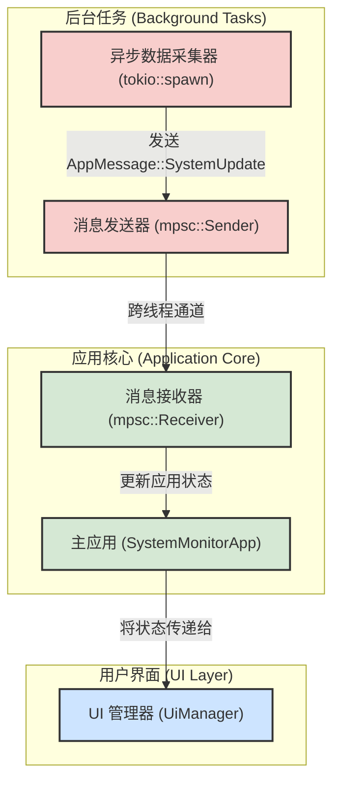

# 系统监控工具 (System Monitor)

一个基于 Rust 和 egui 构建的现代化、轻量级 Windows 系统监控工具。它提供实时的系统性能指标，并采用解耦和异步的架构以实现最佳性能和响应性。

## 核心功能

*   **实时数据监控**:
    *   CPU 使用率（总体和各核心）
    *   内存使用情况（总内存、已用内存、可用内存）
    *   磁盘空间占用（每个驱动器的使用情况）
*   **系统信息概览**:
    *   操作系统版本
    *   计算机名称
    *   启动时间
*   **直观的图形界面**:
    *   使用 `egui` 构建，确保流畅和响应迅速的用户体验。
    *   通过图表和进度条清晰地展示数据。
*   **可配置性**:
    *   支持用户自定义数据刷新间隔。

## 架构概述

本应用采用了一种将 **UI 渲染** 与 **核心逻辑** 彻底分离的现代架构，并通过异步消息传递进行通信，以确保 UI 始终保持流畅和响应。



1.  **异步数据采集**:
    *   所有系统数据的采集都在一个独立的后台 `tokio` 任务中进行。
    *   这可以防止耗时的数据 I/O 操作阻塞主 UI 线程，从而保证了界面的流畅性。
2.  **消息传递**:
    *   后台任务采集到新数据后，会将其封装成一个 `AppMessage`。
    *   该消息通过一个多生产者单消费者（mpsc）通道被发送到应用核心。
3.  **状态管理与渲染**:
    *   应用核心在主线程上接收消息，并根据消息内容更新其内部状态 (`AppState`)。
    *   `UiManager` 在每一帧渲染时，都会读取最新的 `AppState` 并将其绘制到屏幕上。

这种单向数据流的设计使得状态管理变得清晰、可预测且易于维护。

## 构建与运行

### 前提条件

*   [Rust](https://www.rust-lang.org/tools/install) (最新稳定版)
*   [Git](https://git-scm.com/downloads)

### 步骤

1.  **克隆仓库**:
    ```bash
    git clone <your-repository-url>
    cd system-monitor
    ```

2.  **构建项目**:
    *   **开发模式**:
        ```bash
        cargo build
        ```
    *   **发布模式** (优化性能):
        ```bash
        cargo build --release
        ```

3.  **运行应用**:
    *   **开发模式**:
        ```bash
        cargo run
        ```
    *   **发布模式**:
        ```bash
        cargo run --release
        ```
        或者直接运行 `target/release/system-monitor.exe`。