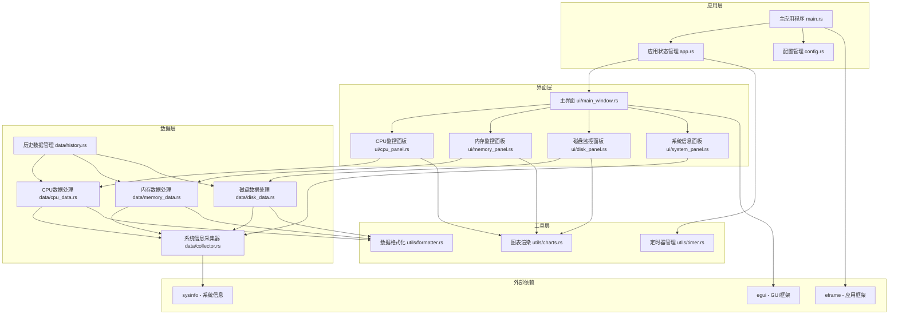
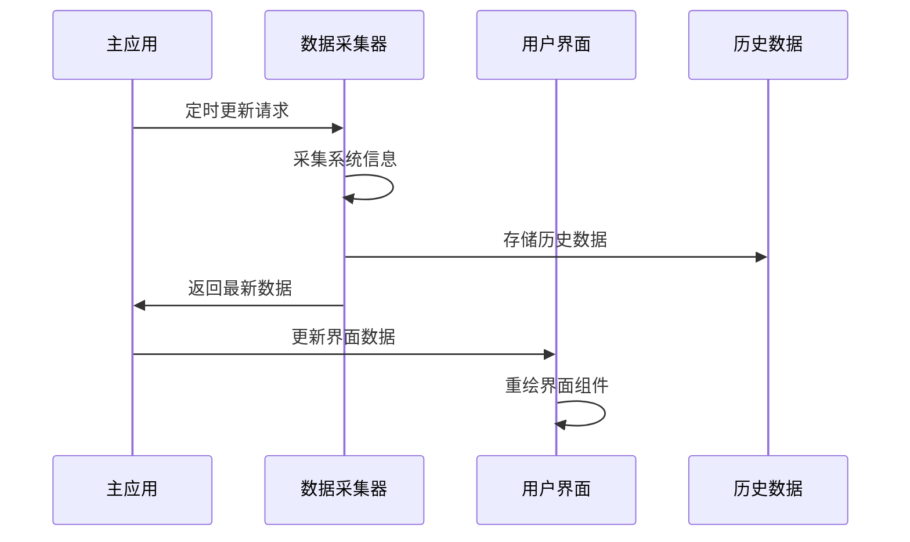

# Rust+egui系统监控工具 - 架构设计

## 项目概述

基于Rust和egui构建的Windows系统监控工具，提供实时系统性能信息显示。

## 系统架构图



## 核心模块设计

### 1. 主应用程序 (main.rs)
```rust
// 应用程序入口点
// 初始化egui应用
// 设置窗口属性和图标
```

### 2. 应用状态管理 (app.rs)
```rust
pub struct SystemMonitorApp {
    // 系统数据采集器
    collector: SystemCollector,
    // 历史数据存储
    history: DataHistory,
    // 应用配置
    config: AppConfig,
    // UI状态
    ui_state: UiState,
    // 更新定时器
    update_timer: Timer,
}
```

### 3. 系统信息采集 (data/collector.rs)
```rust
pub struct SystemCollector {
    system: System,
    last_update: Instant,
    update_interval: Duration,
}

impl SystemCollector {
    pub fn new() -> Self
    pub fn update(&mut self) -> Result<SystemData, CollectorError>
    pub fn get_cpu_usage(&self) -> Vec<f32>
    pub fn get_memory_info(&self) -> MemoryInfo
    pub fn get_disk_info(&self) -> Vec<DiskInfo>
}
```

### 4. 界面组件设计

#### CPU监控面板 (ui/cpu_panel.rs)
```rust
pub struct CpuPanel {
    history: VecDeque<f32>,
    max_history_size: usize,
}

impl CpuPanel {
    pub fn show(&mut self, ui: &mut Ui, cpu_data: &CpuData)
    fn draw_cpu_chart(&self, ui: &mut Ui, data: &[f32])
    fn draw_cpu_cores(&self, ui: &mut Ui, cores: &[f32])
}
```

#### 内存监控面板 (ui/memory_panel.rs)
```rust
pub struct MemoryPanel;

impl MemoryPanel {
    pub fn show(&mut self, ui: &mut Ui, memory_data: &MemoryData)
    fn draw_memory_usage_bar(&self, ui: &mut Ui, used: u64, total: u64)
    fn draw_memory_details(&self, ui: &mut Ui, data: &MemoryData)
}
```

## 数据流设计



## 项目结构

```
system-monitor/
├── Cargo.toml
├── src/
│   ├── main.rs                 # 应用入口
│   ├── app.rs                  # 主应用逻辑
│   ├── config.rs               # 配置管理
│   ├── ui/
│   │   ├── mod.rs
│   │   ├── main_window.rs      # 主窗口
│   │   ├── cpu_panel.rs        # CPU监控面板
│   │   ├── memory_panel.rs     # 内存监控面板
│   │   ├── disk_panel.rs       # 磁盘监控面板
│   │   └── system_panel.rs     # 系统信息面板
│   ├── data/
│   │   ├── mod.rs
│   │   ├── collector.rs        # 系统信息采集
│   │   ├── cpu_data.rs         # CPU数据处理
│   │   ├── memory_data.rs      # 内存数据处理
│   │   ├── disk_data.rs        # 磁盘数据处理
│   │   └── history.rs          # 历史数据管理
│   └── utils/
│       ├── mod.rs
│       ├── charts.rs           # 图表渲染工具
│       ├── formatter.rs        # 数据格式化
│       └── timer.rs            # 定时器管理
├── assets/
│   └── icon.ico                # 应用图标
└── README.md
```

## 核心依赖关系

```toml
[dependencies]
egui = "0.24"
eframe = { version = "0.24", default-features = false, features = [
    "default_fonts",
    "glow",
    "persistence",
] }
sysinfo = "0.29"
serde = { version = "1.0", features = ["derive"] }
chrono = { version = "0.4", features = ["serde"] }
```

## 性能考虑

1. **数据采集频率**: 默认1秒更新一次，可配置
2. **历史数据限制**: 最多保存最近1000个数据点
3. **内存优化**: 使用循环缓冲区存储历史数据
4. **渲染优化**: 只在数据变化时重绘相关组件

## 配置系统

```rust
#[derive(Serialize, Deserialize)]
pub struct AppConfig {
    pub update_interval_ms: u64,
    pub max_history_points: usize,
    pub show_cpu_cores: bool,
    pub show_process_list: bool,
    pub window_size: (f32, f32),
}
```

## 错误处理策略

```rust
#[derive(Debug)]
pub enum SystemMonitorError {
    CollectorError(String),
    ConfigError(String),
    UiError(String),
}

pub type Result<T> = std::result::Result<T, SystemMonitorError>;