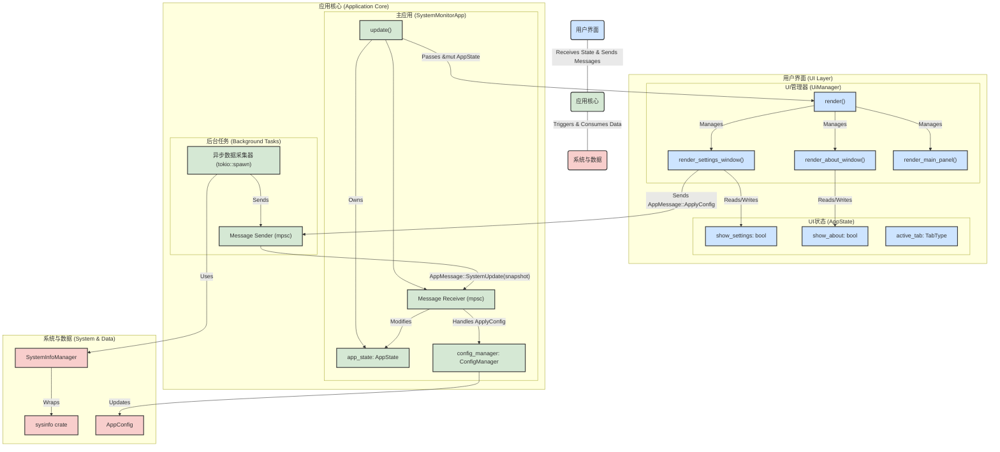

# Rust+egui系统监控工具 - 增强架构设计

## 1. 架构优化概述

基于 `improvement-specification.md` 的重构计划，本文档描述了更新后的系统架构。核心改进在于：

- **UI与逻辑的彻底解耦**: `SystemMonitorApp` 作为应用核心，负责状态管理和消息处理，而 `UiManager` 则全权负责所有渲染任务。
- **异步数据采集**: 数据采集在专用的后台任务中运行，通过消息通道将数据传递给应用核心，从而避免阻塞UI线程，提升了应用的响应性。
- **单向数据流**: UI通过发送消息来请求更改（如更新配置），而不是直接调用核心逻辑，确保了状态变更的可预测性和可维护性。
- **健壮的资源管理**: 引入了更可靠的字体加载和配置管理机制。

## 2. 优化后的系统架构



## 3. 核心接口设计

### 3.1 数据采集接口

```rust
// 系统信息采集的统一接口
pub trait SystemInfoCollector: Send + Sync {
    type Error: std::error::Error + Send + Sync + 'static;
    
    async fn collect_cpu_info(&self) -> Result<CpuInfo, Self::Error>;
    async fn collect_memory_info(&self) -> Result<MemoryInfo, Self::Error>;
    async fn collect_disk_info(&self) -> Result<Vec<DiskInfo>, Self::Error>;
    async fn collect_system_info(&self) -> Result<SystemInfo, Self::Error>;
    
    fn set_collection_interval(&mut self, interval: Duration);
    fn get_collection_interval(&self) -> Duration;
}

// Windows特定实现
pub struct WindowsSystemCollector {
    system: System,
    config: CollectorConfig,
    cache: Arc<RwLock<SystemDataCache>>,
}

impl SystemInfoCollector for WindowsSystemCollector {
    type Error = CollectorError;
    
    // 实现具体的采集逻辑
}
```

### 3.2 数据处理接口

```rust
// 数据处理的统一接口
pub trait DataProcessor<T>: Send + Sync {
    type Input;
    type Output;
    type Error: std::error::Error + Send + Sync + 'static;
    
    fn process(&self, input: Self::Input) -> Result<Self::Output, Self::Error>;
    fn validate(&self, data: &Self::Input) -> Result<(), Self::Error>;
    fn format(&self, data: &Self::Output) -> String;
}

// CPU数据处理器
pub struct CpuDataProcessor {
    smoothing_factor: f32,
    threshold_config: ThresholdConfig,
}

impl DataProcessor<CpuData> for CpuDataProcessor {
    type Input = RawCpuData;
    type Output = ProcessedCpuData;
    type Error = ProcessingError;
    
    // 实现CPU数据处理逻辑
}
```

### 3.3 UI组件接口

```rust
// UI组件的统一接口
pub trait UiComponent {
    type Data;
    type Config;
    
    fn render(&mut self, ui: &mut egui::Ui, data: &Self::Data, config: &Self::Config);
    fn handle_interaction(&mut self, response: &egui::Response) -> Option<UiEvent>;
    fn update_config(&mut self, config: Self::Config);
}

// CPU面板实现
pub struct CpuPanel {
    chart_renderer: ChartRenderer,
    config: CpuPanelConfig,
    state: CpuPanelState,
}

impl UiComponent for CpuPanel {
    type Data = ProcessedCpuData;
    type Config = CpuPanelConfig;
    
    // 实现UI渲染逻辑
}
```

## 4. 优化的文件结构

```
system-monitor/
├── Cargo.toml
├── build.rs                    # 构建脚本
├── src/
│   ├── main.rs                 # 应用入口
│   ├── lib.rs                  # 库入口
│   ├── app/
│   │   ├── mod.rs
│   │   ├── application.rs      # 主应用逻辑
│   │   ├── ui_controller.rs    # UI控制器
│   │   └── event_handler.rs    # 事件处理
│   ├── ui/
│   │   ├── mod.rs
│   │   ├── components/         # UI组件
│   │   │   ├── mod.rs
│   │   │   ├── cpu_panel.rs
│   │   │   ├── memory_panel.rs
│   │   │   ├── disk_panel.rs
│   │   │   ├── system_panel.rs
│   │   │   └── settings_panel.rs
│   │   ├── widgets/            # 自定义控件
│   │   │   ├── mod.rs
│   │   │   ├── chart.rs
│   │   │   ├── progress_ring.rs
│   │   │   └── status_indicator.rs
│   │   └── themes/             # 主题管理
│   │       ├── mod.rs
│   │       ├── default.rs
│   │       └── dark.rs
│   ├── business/
│   │   ├── mod.rs
│   │   ├── data_manager.rs     # 数据管理
│   │   ├── config_manager.rs   # 配置管理
│   │   ├── state_manager.rs    # 状态管理
│   │   └── notification_manager.rs # 通知管理
│   ├── data/
│   │   ├── mod.rs
│   │   ├── collectors/         # 数据采集器
│   │   │   ├── mod.rs
│   │   │   ├── system_collector.rs
│   │   │   ├── cpu_collector.rs
│   │   │   ├── memory_collector.rs
│   │   │   └── disk_collector.rs
│   │   ├── processors/         # 数据处理器
│   │   │   ├── mod.rs
│   │   │   ├── cpu_processor.rs
│   │   │   ├── memory_processor.rs
│   │   │   └── disk_processor.rs
│   │   ├── models/             # 数据模型
│   │   │   ├── mod.rs
│   │   │   ├── cpu_data.rs
│   │   │   ├── memory_data.rs
│   │   │   ├── disk_data.rs
│   │   │   └── system_data.rs
│   │   └── history/            # 历史数据管理
│   │       ├── mod.rs
│   │       ├── history_manager.rs
│   │       └── cache_manager.rs
│   ├── infrastructure/
│   │   ├── mod.rs
│   │   ├── timer_service.rs    # 定时器服务
│   │   ├── logging_service.rs  # 日志服务
│   │   ├── error_handler.rs    # 错误处理
│   │   └── performance_monitor.rs # 性能监控
│   ├── platform/
│   │   ├── mod.rs
│   │   ├── windows/            # Windows特定实现
│   │   │   ├── mod.rs
│   │   │   ├── api_wrapper.rs
│   │   │   └── system_info.rs
│   │   └── traits.rs           # 平台抽象接口
│   ├── utils/
│   │   ├── mod.rs
│   │   ├── formatters.rs       # 数据格式化
│   │   ├── validators.rs       # 数据验证
│   │   └── helpers.rs          # 辅助函数
│   └── config/
│       ├── mod.rs
│       ├── app_config.rs       # 应用配置
│       ├── ui_config.rs        # UI配置
│       └── default_config.rs   # 默认配置
├── tests/
│   ├── integration/            # 集成测试
│   │   ├── mod.rs
│   │   ├── data_collection_tests.rs
│   │   └── ui_interaction_tests.rs
│   └── unit/                   # 单元测试
│       ├── mod.rs
│       ├── data_processor_tests.rs
│       └── config_manager_tests.rs
├── benches/                    # 性能基准测试
│   ├── data_collection_bench.rs
│   └── ui_rendering_bench.rs
├── assets/
│   ├── icons/
│   │   ├── app.ico
│   │   └── tray.ico
│   └── configs/
│       └── default.toml
├── docs/                       # 文档
│   ├── architecture.md
│   ├── api.md
│   └── deployment.md
└── scripts/                    # 构建脚本
    ├── build.ps1
    └── package.ps1
```

## 5. 依赖关系优化

### 5.1 依赖注入设计

```rust
// 依赖注入容器
pub struct ServiceContainer {
    system_collector: Arc<dyn SystemInfoCollector>,
    data_processors: HashMap<String, Arc<dyn DataProcessor<SystemData>>>,
    config_manager: Arc<dyn ConfigManager>,
    logger: Arc<dyn Logger>,
}

impl ServiceContainer {
    pub fn new() -> Self {
        let mut container = ServiceContainer {
            system_collector: Arc::new(WindowsSystemCollector::new()),
            data_processors: HashMap::new(),
            config_manager: Arc::new(FileConfigManager::new()),
            logger: Arc::new(FileLogger::new()),
        };
        
        // 注册数据处理器
        container.register_processor("cpu", Arc::new(CpuDataProcessor::new()));
        container.register_processor("memory", Arc::new(MemoryDataProcessor::new()));
        container.register_processor("disk", Arc::new(DiskDataProcessor::new()));
        
        container
    }
    
    pub fn register_processor<T>(&mut self, name: &str, processor: Arc<T>) 
    where 
        T: DataProcessor<SystemData> + 'static 
    {
        self.data_processors.insert(name.to_string(), processor);
    }
}
```

### 5.2 事件驱动架构

```rust
// 事件系统
#[derive(Debug, Clone)]
pub enum SystemEvent {
    DataUpdated(SystemData),
    ConfigChanged(AppConfig),
    ErrorOccurred(SystemError),
    UserInteraction(UiEvent),
}

pub trait EventHandler: Send + Sync {
    fn handle_event(&self, event: SystemEvent) -> Result<(), EventError>;
}

pub struct EventBus {
    handlers: Vec<Arc<dyn EventHandler>>,
    sender: mpsc::UnboundedSender<SystemEvent>,
    receiver: mpsc::UnboundedReceiver<SystemEvent>,
}

impl EventBus {
    pub fn new() -> Self {
        let (sender, receiver) = mpsc::unbounded_channel();
        EventBus {
            handlers: Vec::new(),
            sender,
            receiver,
        }
    }
    
    pub fn subscribe(&mut self, handler: Arc<dyn EventHandler>) {
        self.handlers.push(handler);
    }
    
    pub fn publish(&self, event: SystemEvent) -> Result<(), EventError> {
        self.sender.send(event).map_err(EventError::from)
    }
    
    pub async fn process_events(&mut self) {
        while let Some(event) = self.receiver.recv().await {
            for handler in &self.handlers {
                if let Err(e) = handler.handle_event(event.clone()) {
                    eprintln!("Event handling error: {}", e);
                }
            }
        }
    }
}
```

## 6. 性能优化策略

### 6.1 异步数据采集

为了防止UI线程阻塞并提高应用响应性，数据采集被重构为在后台 `tokio` 任务中运行的完全异步流程。

**实现细节:**

1.  **后台任务启动**: 在 `SystemMonitorApp` 初始化时，会启动一个独立的 `tokio::spawn` 任务。
2.  **循环与间隔**: 该任务在一个无限循环中运行，使用 `tokio::time::interval` 来控制数据采集的频率（例如，每秒一次）。
3.  **并行采集**: 在循环的每个 `tick` 中，它会调用 `SystemInfoManager` 的异步方法（如 `get_snapshot()`）。此方法内部使用 `tokio::try_join!` 来并行执行所有单个指标（CPU、内存、磁盘等）的异步获取。
4.  **非阻塞IO**: `sysinfo` 的同步调用被包裹在 `tokio::task::spawn_blocking` 中，确保它们不会阻塞 `tokio` 的工作线程。
5.  **消息传递**: 采集完成后，获得的数据快照（`SystemSnapshot`）或发生的任何错误都会被封装在一个 `AppMessage` 枚举中（例如 `AppMessage::SystemUpdate(snapshot)`），并通过 `mpsc` 无界通道发送到主应用线程。
6.  **主线程处理**: `SystemMonitorApp` 的 `update` 循环会接收这些消息，并相应地更新其内部状态 (`AppState`)，而UI则在下一帧中自动反映这些状态变化。

```rust
// 伪代码示例: 后台采集任务
tokio::spawn(async move {
    let mut interval = tokio::time::interval(refresh_duration);
    loop {
        interval.tick().await;
        match system_manager.get_snapshot().await {
            Ok(snapshot) => {
                // 通过 mpsc 通道将成功获取的数据发送出去
                let _ = sender.send(AppMessage::SystemUpdate(snapshot));
            },
            Err(e) => {
                // 发送错误消息
                let _ = sender.send(AppMessage::Error(e.to_string()));
            }
        }
    }
});
```

### 6.2 智能缓存系统
```rust
// 多层缓存系统
pub struct DataCache {
    l1_cache: LruCache<String, SystemData>,      // 内存缓存
    l2_cache: Option<DiskCache>,                 // 磁盘缓存
    cache_config: CacheConfig,
}

impl DataCache {
    pub fn new(config: CacheConfig) -> Self {
        DataCache {
            l1_cache: LruCache::new(config.l1_capacity),
            l2_cache: if config.enable_l2 {
                Some(DiskCache::new(config.l2_path.clone()))
            } else {
                None
            },
            cache_config: config,
        }
    }
    
    pub async fn get(&self, key: &str) -> Option<SystemData> {
        // 先查L1缓存
        if let Some(data) = self.l1_cache.get(key) {
            return Some(data.clone());
        }
        
        // 再查L2缓存
        if let Some(ref l2) = self.l2_cache {
            if let Ok(data) = l2.get(key).await {
                // 回填L1缓存
                self.l1_cache.put(key.to_string(), data.clone());
                return Some(data);
            }
        }
        
        None
    }
    
    pub async fn put(&mut self, key: String, data: SystemData) {
        // 更新L1缓存
        self.l1_cache.put(key.clone(), data.clone());
        
        // 异步更新L2缓存
        if let Some(ref mut l2) = self.l2_cache {
            let _ = l2.put(key, data).await;
        }
    }
}
```

### 6.3 内存优化

```rust
// 内存池管理
pub struct MemoryPool<T> {
    pool: Vec<Box<T>>,
    factory: Box<dyn Fn() -> T + Send + Sync>,
    max_size: usize,
}

impl<T> MemoryPool<T> {
    pub fn new<F>(factory: F, max_size: usize) -> Self 
    where 
        F: Fn() -> T + Send + Sync + 'static 
    {
        MemoryPool {
            pool: Vec::with_capacity(max_size),
            factory: Box::new(factory),
            max_size,
        }
    }
    
    pub fn acquire(&mut self) -> Box<T> {
        self.pool.pop().unwrap_or_else(|| Box::new((self.factory)()))
    }
    
    pub fn release(&mut self, item: Box<T>) {
        if self.pool.len() < self.max_size {
            self.pool.push(item);
        }
    }
}

// 数据结构优化
#[derive(Clone)]
pub struct OptimizedSystemData {
    cpu_usage: f32,
    cpu_cores: SmallVec<[f32; 16]>,        // 大多数系统核心数 <= 16
    memory_info: MemoryInfo,
    disk_info: SmallVec<[DiskInfo; 4]>,    // 大多数系统磁盘数 <= 4
    timestamp: u64,                        // 使用时间戳而非DateTime
}
```

## 7. 错误处理和恢复策略

### 7.1 分层错误处理

```rust
// 错误类型层次结构
#[derive(Debug, thiserror::Error)]
pub enum SystemMonitorError {
    #[error("数据采集错误: {0}")]
    Collection(#[from] CollectionError),
    
    #[error("数据处理错误: {0}")]
    Processing(#[from] ProcessingError),
    
    #[error("UI渲染错误: {0}")]
    Rendering(#[from] RenderingError),
    
    #[error("配置错误: {0}")]
    Configuration(#[from] ConfigError),
    
    #[error("系统错误: {0}")]
    System(#[from] SystemError),
}

#[derive(Debug, thiserror::Error)]
pub enum CollectionError {
    #[error("系统API调用失败: {message}")]
    ApiCallFailed { message: String },
    
    #[error("权限不足")]
    InsufficientPermissions,
    
    #[error("超时: {timeout_ms}ms")]
    Timeout { timeout_ms: u64 },
    
    #[error("数据格式错误")]
    InvalidData,
}

// 错误恢复策略
pub struct ErrorRecoveryManager {
    retry_policies: HashMap<String, RetryPolicy>,
    fallback_strategies: HashMap<String, Box<dyn FallbackStrategy>>,
    circuit_breakers: HashMap<String, CircuitBreaker>,
}

impl ErrorRecoveryManager {
    pub async fn handle_error(&self, error: SystemMonitorError, context: &str) -> RecoveryAction {
        match error {
            SystemMonitorError::Collection(CollectionError::Timeout { .. }) => {
                // 对于超时错误，使用重试策略
                if let Some(policy) = self.retry_policies.get(context) {
                    return RecoveryAction::Retry(policy.clone());
                }
            }
            
            SystemMonitorError::Collection(CollectionError::ApiCallFailed { .. }) => {
                // 对于API调用失败，检查熔断器状态
                if let Some(cb) = self.circuit_breakers.get(context) {
                    if cb.should_trip() {
                        return RecoveryAction::UseFallback;
                    }
                }
            }
            
            _ => {}
        }
        
        RecoveryAction::LogAndContinue
    }
}

#[derive(Debug, Clone)]
pub enum RecoveryAction {
    Retry(RetryPolicy),
    UseFallback,
    LogAndContinue,
    Shutdown,
}
```

### 7.2 优雅降级机制

```rust
// 降级服务
pub struct DegradationService {
    fallback_data: Arc<RwLock<FallbackData>>,
    degradation_level: AtomicU8,
}

impl DegradationService {
    pub fn new() -> Self {
        DegradationService {
            fallback_data: Arc::new(RwLock::new(FallbackData::default())),
            degradation_level: AtomicU8::new(0),
        }
    }
    
    pub async fn get_system_data(&self) -> Result<SystemData, SystemMonitorError> {
        let level = self.degradation_level.load(Ordering::Relaxed);
        
        match level {
            0 => {
                // 正常模式：实时采集
                self.collect_real_time_data().await
            }
            1 => {
                // 轻度降级：使用缓存数据
                self.get_cached_data().await
            }
            2 => {
                // 中度降级：使用模拟数据
                self.get_simulated_data().await
            }
            _ => {
                // 重度降级：使用静态数据
                Ok(self.get_static_data().await)
            }
        }
    }
    
    pub fn escalate_degradation(&self) {
        let current = self.degradation_level.load(Ordering::Relaxed);
        if current < 3 {
            self.degradation_level.store(current + 1, Ordering::Relaxed);
            log::warn!("系统降级至级别 {}", current + 1);
        }
    }
    
    pub fn recover_degradation(&self) {
        let current = self.degradation_level.load(Ordering::Relaxed);
        if current > 0 {
            self.degradation_level.store(current - 1, Ordering::Relaxed);
            log::info!("系统恢复至级别 {}", current - 1);
        }
    }
}
```

## 8. 详细实施计划

### 8.1 开发阶段划分

#### 第一阶段：基础架构 (1-2周)
**目标**: 建立项目基础架构和核心接口

**任务清单**:
- [ ] 创建项目结构和模块划分
- [ ] 实现核心接口定义 (`SystemInfoCollector`, `DataProcessor`, `UiComponent`)
- [ ] 建立依赖注入容器
- [ ] 实现基础错误处理系统
- [ ] 配置构建系统和CI/CD流水线

**交付物**:
- 完整的项目骨架
- 核心接口文档
- 基础单元测试框架

#### 第二阶段：数据采集层 (2-3周)
**目标**: 实现系统信息采集功能

**任务清单**:
- [ ] 实现 `WindowsSystemCollector`
- [ ] 实现各类数据处理器 (`CpuDataProcessor`, `MemoryDataProcessor`, `DiskDataProcessor`)
- [ ] 实现异步数据采集机制
- [ ] 实现缓存系统
- [ ] 添加性能监控和优化

**交付物**:
- 完整的数据采集系统
- 性能基准测试报告
- 数据采集API文档

#### 第三阶段：用户界面层 (2-3周)
**目标**: 实现用户界面和交互功能

**任务清单**:
- [ ] 实现主窗口和导航系统
- [ ] 实现各监控面板 (`CpuPanel`, `MemoryPanel`, `DiskPanel`, `SystemPanel`)
- [ ] 实现自定义图表组件
- [ ] 实现设置面板和配置管理
- [ ] 实现主题系统

**交付物**:
- 完整的用户界面
- UI组件库文档
- 用户交互测试报告

#### 第四阶段：集成和优化 (1-2周)
**目标**: 系统集成、性能优化和稳定性测试

**任务清单**:
- [ ] 集成所有模块
- [ ] 性能优化和内存泄漏检查
- [ ] 错误处理和恢复机制测试
- [ ] 长时间运行稳定性测试
- [ ] 用户体验优化

**交付物**:
- 完整的系统监控工具
- 性能测试报告
- 用户手册

#### 第五阶段：部署和发布 (1周)
**目标**: 准备发布版本

**任务清单**:
- [ ] 创建安装包和便携版本
- [ ] 编写部署文档
- [ ] 准备发布说明
- [ ] 最终测试和质量保证

**交付物**:
- 发布版本
- 部署文档
- 用户支持文档

### 8.2 里程碑定义

| 里程碑 | 时间点 | 关键指标 | 验收标准 |
|--------|--------|----------|----------|
| M1: 架构完成 | 第2周末 | 代码覆盖率 > 60% | 所有核心接口定义完成，基础测试通过 |
| M2: 数据层完成 | 第5周末 | 数据采集准确率 > 95% | 系统信息采集功能完整，性能达标 |
| M3: UI层完成 | 第8周末 | UI响应时间 < 100ms | 所有界面组件实现，交互流畅 |
| M4: 集成完成 | 第10周末 | 24小时稳定运行 | 系统集成完成，稳定性测试通过 |
| M5: 发布就绪 | 第11周末 | 用户验收测试通过 | 发布版本准备完成，文档齐全 |

### 8.3 质量保证策略

#### 代码质量
- **代码审查**: 所有代码必须经过同行审查
- **静态分析**: 使用 `clippy` 进行代码质量检查
- **格式化**: 使用 `rustfmt` 保持代码风格一致
- **文档**: 所有公共API必须有完整的文档注释

#### 测试策略
- **单元测试**: 目标覆盖率 80%+
- **集成测试**: 覆盖主要用户场景
- **性能测试**: 定期进行基准测试
- **压力测试**: 模拟长时间运行和高负载场景

#### 持续集成
```yaml
# .github/workflows/ci.yml
name: CI/CD Pipeline

on:
  push:
    branches: [ main, develop ]
  pull_request:
    branches: [ main ]

jobs:
  test:
    runs-on: windows-latest
    steps:
    - uses: actions/checkout@v3
    - uses: actions-rs/toolchain@v1
      with:
        toolchain: stable
        components: rustfmt, clippy
    
    - name: Format check
      run: cargo fmt --all -- --check
    
    - name: Clippy check
      run: cargo clippy --all-targets --all-features -- -D warnings
    
    - name: Run tests
      run: cargo test --all-features
    
    - name: Run benchmarks
      run: cargo bench
    
    - name: Build release
      run: cargo build --release
```

## 9. 风险评估和缓解策略

### 9.1 技术风险

| 风险 | 概率 | 影响 | 缓解策略 |
|------|------|------|----------|
| Windows API兼容性问题 | 中 | 高 | 早期原型验证，多版本测试 |
| egui性能瓶颈 | 低 | 中 | 性能基准测试，优化策略预案 |
| 内存泄漏 | 中 | 高 | 严格的内存管理，定期检查 |
| 第三方依赖更新 | 高 | 低 | 版本锁定，定期更新计划 |

### 9.2 项目风险

| 风险 | 概率 | 影响 | 缓解策略 |
|------|------|------|----------|
| 开发进度延迟 | 中 | 中 | 敏捷开发，定期评估调整 |
| 需求变更 | 高 | 中 | 模块化设计，灵活架构 |
| 团队协作问题 | 低 | 高 | 清晰的接口定义，定期沟
## 7. UI与应用逻辑分离

为了实现更清晰的关注点分离和单一职责原则，应用的核心逻辑与UI渲染逻辑被彻底解耦。

### 7.1 职责划分

-   **`SystemMonitorApp` (应用核心)**:
    -   **不包含任何 `egui` 渲染代码**。
    -   持有并管理核心应用状态 (`AppState`)。
    -   负责创建和管理后台任务（如异步数据采集器）。
    -   包含一个 `mpsc` 消息接收器，用于处理来自后台任务和UI的事件 (`AppMessage`)。
    -   在 `eframe::App::update` 方法中，它调用消息处理逻辑，然后将对 `AppState` 的可变引用传递给 `UiManager` 进行渲染。

-   **`UiManager` (UI渲染器)**:
    -   **包含所有 `egui` 渲染代码**，包括主窗口、面板、标签页以及设置和关于等弹出窗口。
    -   在其 `render` 方法中接收对 `AppState` 的可变引用，并根据该状态绘制整个UI。
    -   持有 `mpsc` 消息发送器，用于将用户交互（如点击按钮、更改设置）作为 `AppMessage` 发送回 `SystemMonitorApp` 进行处理。
    -   自身不持有可变的状态，是“无状态的”，其渲染结果完全由传入的 `AppState` 决定。

### 7.2 交互流程 (单向数据流)

1.  **状态驱动UI**: `SystemMonitorApp` 将 `AppState` 传递给 `UiManager`。`UiManager` 根据 `AppState` 的值（例如 `app_state.show_settings`）来决定是否渲染某个UI组件（如设置窗口）。
2.  **事件驱动状态**: 当用户在UI中进行操作（例如，在设置窗口中点击“应用”按钮），`UiManager` **不会**直接修改 `AppState` 或 `AppConfig`。相反，它会创建一个包含新配置数据的 `AppMessage::ApplyConfig(new_config)` 消息，并将其发送到 `SystemMonitorApp`。
3.  **核心处理逻辑**: `SystemMonitorApp` 在其下一个 `update` 周期中接收到该消息，并调用 `ConfigManager` 来安全地更新配置。如果需要，它还可以修改 `AppState`（例如，设置 `app_state.show_settings = false` 来关闭窗口）。
4.  **UI刷新**: 在下一个渲染帧中，`UiManager` 会接收到更新后的 `AppState`，并自动渲染出新的UI状态（例如，设置窗口被关闭）。

这个模型强制执行了一个清晰的单向数据流，极大地提高了代码的可预测性、可测试性和可维护性。